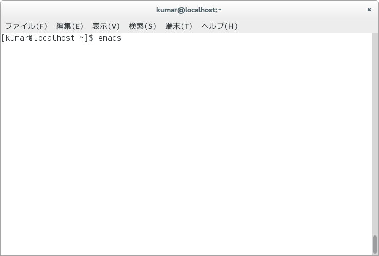
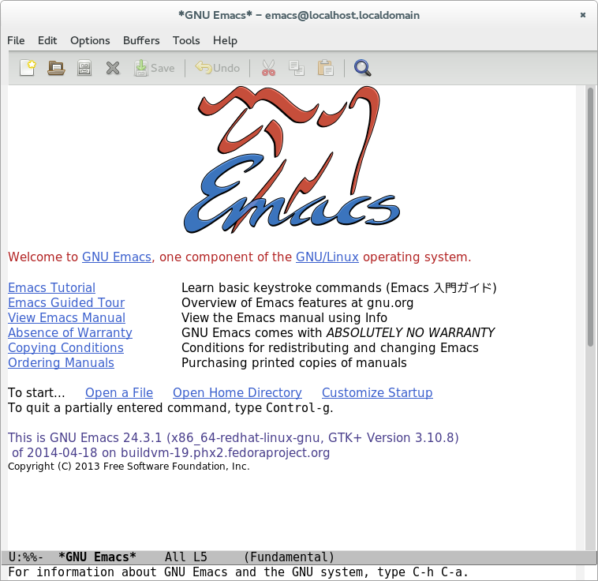
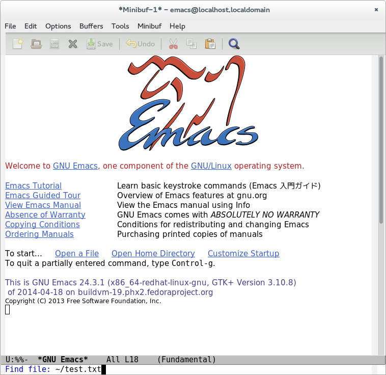
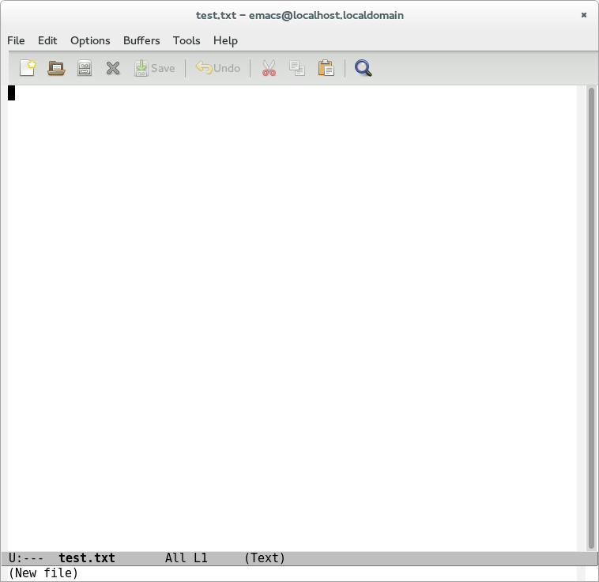
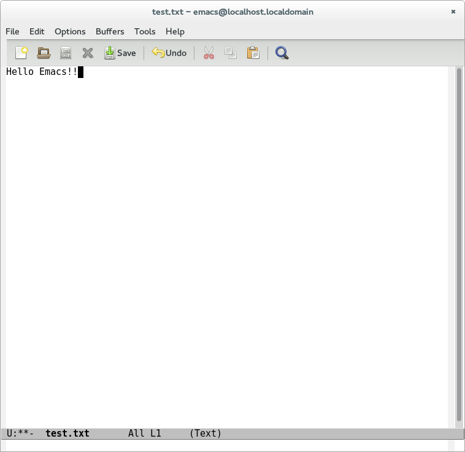
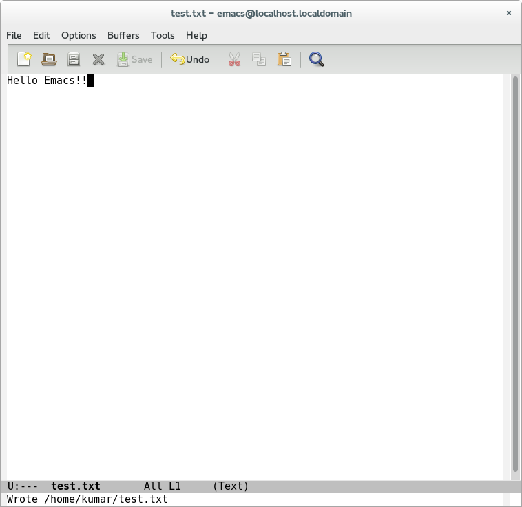

# Emacs 入門
## @kumar8600

> Emacs（イーマックス）とは高機能でカスタマイズ性の高いテキストエディタである。スクリーン・エディタとしての人気が高く、特にUNIXのプログラマを中心としたコンピュータ技術者に愛用者が多い。[1][]

---
# 目次

- なぜEmacs？
- 初体験
- コラム
- カスタマイズ

---
# なぜEmacs？

---
# Emacsは宗教

  
Emacs教会の聖イグヌチウス( Saint IGNUcius of the Church of Emacs ) [2][]

---
## 聖イグヌ(GNU)シアスの説教 [3][]

> 我こそは聖イグヌ(GNU)シアスである。Emacs教会より派遣さる。我、ここに我が子らのコンピューターを祝福す。
> 
> Emacsはそのはじめ、テキストエディターとして始まりしが、多くのユーザーにとりては人生なりき。如何となれば、Emacsを終了することなく、すべての作業を行えるがためなり。ある者、ニュースグループalt.religion.emacsを始めしより、宗教となれり。今日、我々は競合関係にある異教徒のエディターと争えり。また、聖人あり。幸いにして神はなし。神の代わりに、我らはエディターを崇拝す。

---
> 
> Emacs教会の信者となるためには、汝ら戒律を唱えるべし。
> 
> 曰く、「GNUの他にはシステムなく、Linuxはそのカーネルのひとつに過ぎぬ」と。
> 
> 汝、ハッカーになりたれば、foobarミツワーなる神聖なる儀式あり。その次第、集いたるハッカーの前に立ち、神聖なるシステムのソースコードを読経するものなり。
> 
> また、Emacs処女なるものあり。これは、いまだEmacsに触れざる者のことなり。Emacs処女なる者らに、その処女性を失う機会を提供するは、祝福されたる行いなり。

---
> 
> Emacs教会は、あえて言及せぬ他の宗教にくらぶれば、利点多し。Emacs教会の聖人たらんとするに、非妻帯の戒なし。故に、汝ら信者たらんと欲すれば、すなわち信者たる資格を得る。
> 
> されど、汝ら純潔を守るべき事あり。汝ら、もし、邪悪な制限ソフトウェアのインストールされたるコンピューターを所有して支配下に置きし時、かかるコンピューターに、神聖にして完全なる(holy/wholly)自由なオペレーティングシステムをインストールし、その上に自由なるソフトウェアのみをインストールすべし。この誓いを守りて貫き通したれば、いずれ汝ら聖人となり、その頭に光背を頂くに至らん。しかし、これまったく汝ら光背を見つけたればなり。如何となれば、これすでに製造されること絶えてなければなり。
>

---
> 時に、汝ら問いて曰く、「Emacs教会に身を置きながら、viなるテキストエディターを使うことは罪なるか」と。いかにも、vi vi viは獣の数字なるが、自由な実装のviを使いたるときは、罪ならず。そは贖罪なり。

---
> 時に、汝ら問いて曰く、「その光背は、まことには古いコンピューターディスクならん」と。これはコンピューターディスクにあらず。我が光背なり。されど、これは前世においてはコンピューターディスクたりし。感謝。


---

どうですか？Emacsを学びたくなりましたよね？

Emacs処女の皆さん、あるいはそうでない方も、Emacsを起動することで儀式を始めましょう。

---
# Emacsを起動

シェルで以下の文を実行してください。

```bash
$ emacs
```

---


---


---
# ファイルを開く

`C-x C-f` と入力すると、画面下部（ミニバッファ）に `Find file:` と表示されるので、開きたいファイルの名前を入力してください。今回は初めてなので、 `text.txt` と名づけましょうか。（そんなファイルないって？大丈夫、存在しないファイルを「開く」ことが出来ます。）

> `C-x C-f` とは、`Ctrl`キーを押した状態で、`x`を押し、続けて`Ctrl`キーを押したまま`f`を押すことです。

---


---


---
# 文字を入力

なんてことはありません。普通に文章を記述することが出来ます。（とある有名なエディタとは違って。）

ここでは試しに「Hello Emacs!!」と入力してみましょう。

---


---
# ファイルを保存

`C-x C-s` と入力してください。画面下部に `Wrote <ファイルパス>` と表示されたら、保存は成功です！おめでとうございます！

---


---
# Emacsを終了

悲しいですが、 `C-x C-c` と入力してください。Emacsが終了し、儀式は終わりです。お疲れ様でした。

---
# チュートリアル

さて、今まで紹介したのはほんの基本操作です。気が向いたら`C-h t`で、チュートリアルを実行してみませんか。それほど時間はかかりませんし、これをこなせばより効率的にEmacsが使えるようになります。

---
# コラム

---
# emacsenを使っている有名人

> 「emacs」という英語の複数形は「emacsen」とつづられる。[1][]

以下、 [4][] より引用。

---


リチャード・ストールマン
> フリーソフトウェア運動において中心的な役割を果たしている。また、プログラマとしても著名な存在であり、開発者としてその名を連ねるソフトウェアにはEmacsやGCCなどがある。
> Emacs教会の聖イグヌチウス。[5][]

---


グイド・ヴァンロッサム
> オランダ人プログラマであり、プログラミング言語Pythonの作者として知られている。[6][]

---


まつもとゆきひろ
> プログラミング言語「Ruby」の開発者。[7][]

---


リーナス・トーバルズ
> Linuxカーネルを開発し、1991年に一般に公開したことで有名。[8][]
> それのソースコード管理のために、Gitを開発した。[9][]
> Emacs互換である MicroEmacs のカスタム版を使用。[10][]

---

ほかにも沢山いらっしゃるので、調べてみてください。

---
# カスタマイズ

---
Emacsの設定ファイルは、全て`~/.emacs.d/`ディレクトリの中に置かれます。

---
また、emacsの設定ファイルは、Emacs Lispで書かれます。


---
そして、`~/.emacs.d/init.el`は初期化ファイルと呼ばれ、Emacs起動時に自動的に読み込まれます。このファイルを編集して、Emacsを設定するのが普通です。

---
例えば、Emacs起動時にスタートアップスクリーンを表示しないようにするには、以下のようにします。

`~/.emacs.d/init.el`:

```elisp
(custom-set-variables
 '(inhibit-startup-screen t))
```

---
# テーマ

もちろんEmacsにはテーマ機能があります！

---

えっ、ここにあるテーマだけでは足りないって？

---

大丈夫、Emacsはパッケージを用いて、インターネットで公開されている拡張を簡単に導入できます！

---
# パッケージ管理

Emacsではパッケージマネージャ(package.el)を使って、パッケージ管理を行えます。

Web上で公開されている素晴らしいパッケージを導入して、Emacsを強化しましょう！

---
おっと、パッケージをインストールするその前にやることがあります。

---
デフォルトではGNU ELPA (Emacs Lisp Package Archive)という公式のリポジトリが登録されていますが、そこに登録されているパッケージだけでは不十分なので、非公式のリポジトリを追加します。それから、パッケージを初期化します。

---
`~/.emacs.d/init.el`に追記:

```elisp
(require 'package)
;; MELPAを追加
(add-to-list 'package-archives '("melpa" . "http://melpa.milkbox.net/packages/"))
;; Marmaladeを追加
(add-to-list 'package-archives  '("marmalade" . "http://marmalade-repo.org/packages/"))
;; 初期化
(package-initialize)
```

---
# パッケージのインストール

---
# おすすめのパッケージ

---
## 参照

1. [Emacs - Wikipedia http://ja.wikipedia.org/wiki/Emacs][1]
2. [聖イグヌチウス - Wikipedia http://ja.wikipedia.org/wiki/%E8%81%96%E3%82%A4%E3%82%B0%E3%83%8C%E3%83%81%E3%82%A6%E3%82%B9][2]
3. [本の虫: 聖イグヌ(GNU)シアスの説教 http://cpplover.blogspot.jp/2012/06/gnu.html][3]
4. [Famous Emacs Users (that are not famous for using Emacs) | 肉山博客 (Wenshan's Blog) http://wenshanren.org/?p=418][4]
5. [リチャード・ストールマン - Wikipedia http://ja.wikipedia.org/wiki/%E3%83%AA%E3%83%81%E3%83%A3%E3%83%BC%E3%83%89%E3%83%BB%E3%82%B9%E3%83%88%E3%83%BC%E3%83%AB%E3%83%9E%E3%83%B3][5]
6. [グイド・ヴァンロッサム - Wikipedia http://ja.wikipedia.org/wiki/%E3%82%B0%E3%82%A4%E3%83%89%E3%83%BB%E3%83%B4%E3%82%A1%E3%83%B3%E3%83%AD%E3%83%83%E3%82%B5%E3%83%A0][6]
7. [まつもとゆきひろ - Wikipedia http://ja.wikipedia.org/wiki/%E3%81%BE%E3%81%A4%E3%82%82%E3%81%A8%E3%82%86%E3%81%8D%E3%81%B2%E3%82%8D][7]
8. [リーナス・トーバルズ - Wikipedia http://ja.wikipedia.org/wiki/%E3%83%AA%E3%83%BC%E3%83%8A%E3%82%B9%E3%83%BB%E3%83%88%E3%83%BC%E3%83%90%E3%83%AB%E3%82%BA][8]
9. [Git - Wikipedia http://ja.wikipedia.org/wiki/Git][9]
10. [MicroEMACS - Wikipedia, the free encyclopedia http://en.wikipedia.org/wiki/MicroEMACS][10]

[1]: http://ja.wikipedia.org/wiki/Emacs
[2]: http://ja.wikipedia.org/wiki/%E8%81%96%E3%82%A4%E3%82%B0%E3%83%8C%E3%83%81%E3%82%A6%E3%82%B9
[3]: http://cpplover.blogspot.jp/2012/06/gnu.html
[4]: http://wenshanren.org/?p=418
[5]: http://ja.wikipedia.org/wiki/%E3%83%AA%E3%83%81%E3%83%A3%E3%83%BC%E3%83%89%E3%83%BB%E3%82%B9%E3%83%88%E3%83%BC%E3%83%AB%E3%83%9E%E3%83%B3
[6]: http://ja.wikipedia.org/wiki/%E3%82%B0%E3%82%A4%E3%83%89%E3%83%BB%E3%83%B4%E3%82%A1%E3%83%B3%E3%83%AD%E3%83%83%E3%82%B5%E3%83%A0
[7]: http://ja.wikipedia.org/wiki/%E3%81%BE%E3%81%A4%E3%82%82%E3%81%A8%E3%82%86%E3%81%8D%E3%81%B2%E3%82%8D
[8]: http://ja.wikipedia.org/wiki/%E3%83%AA%E3%83%BC%E3%83%8A%E3%82%B9%E3%83%BB%E3%83%88%E3%83%BC%E3%83%90%E3%83%AB%E3%82%BA
[9]: http://ja.wikipedia.org/wiki/Git
[10]: http://en.wikipedia.org/wiki/MicroEMACS


---
# 没スライド

---
## 起動、終了

### 起動

シェルで以下の文を実行:

```bash
$ emacs
```

emacs が起動します。

---
### 終了

`C-x C-c`

emacs は終了しましたか？(保存されていないファイルが有れば、どうするか尋ねられる。)

---
## ファイルを開く、保存する

### 開く

`C-x C-f`

ファイルの内容がバッファに表示される。

---
### 保存する

`C-x C-s`

バッファの内容が上書き保存される。

`C-x C-w`

ファイル名を指定して保存する。

---
## カーソル移動

- 一文字移動
  - 左: `←` or `C-b`
  - 右: `→` or `C-f`
  - 上: `↑` or `C-p`
  - 下: `↓` or `C-n`
- 単語単位で移動
  - 左: `C-b`
  - 右: `C-f`
- 行頭へ: `C-a`
- 行末へ: `C-e`

---
## 改行、削除
- 改行: `Enter` or `C-j`
- 右の文字を削除: `Delete` or `C-d`

---
## キル、ヤンク、マーク

キルとは今で言う切り取り、ヤンクとは今で言う貼り付けです。（ちなみに今で言うクリップボードは、キルリングと呼ばれます。）

- キル
  - カーソル位置から行末まで: `C-k`
- ヤンク
  - カーソル位置にヤンク: `C-y`
- マーク
  - Mark set: `C-space` or `C-@`
    - 領域をキル: `C-w`
    - 領域をコピー: `M-w`

---
## 中止

ほぼすべてのコマンドは、`C-g`で中止できます。困ったらこれを押すと良いでしょう。

---


`M-x`  
: `Meta`キーを押した状態で、`x`を押す。

> `Meta`キーの代用として、現代では`Alt`キーが使われる。(`Esc`キーでも代用できる。だが少し違いが在り、`Esc`キーを押し、離してから`x`を押す。)
